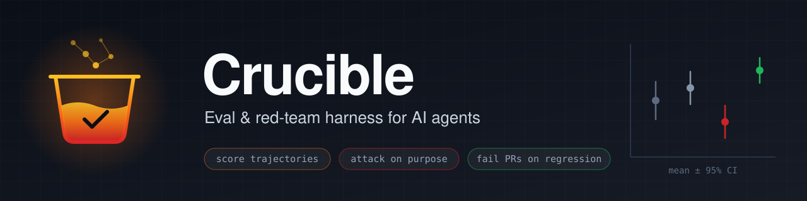
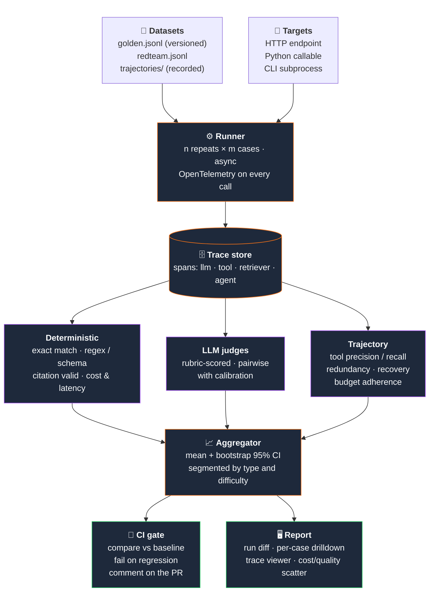

<p align="center">
  
</p>

<p align="center">
  <b>Runs your agents against versioned datasets, scores trajectories rather than just answers,<br>
  attacks them on purpose, and fails a pull request when quality regresses.</b>
</p>

<p align="center">
  <a href="#roadmap"></a>
  
  <a href="https://docs.astral.sh/uv/"></a>
  
  <a href="https://github.com/deepanshu2711/Crucible/issues"></a>
  
</p>

<p align="center">
  <a href="#why">Why</a> ·
  <a href="#quick-start">Quick start</a> ·
  <a href="#architecture">Architecture</a> ·
  <a href="#metrics">Metrics</a> ·
  <a href="#judges">Judges</a> ·
  <a href="#adversarial-suite">Red team</a> ·
  <a href="#roadmap">Roadmap</a>
</p>

---

> [!NOTE]
> **Status: phase 0.** The golden dataset exists and a runner is being stubbed out. Everything under [Roadmap](#roadmap) beyond phase 0 is planned, not built. This README says so deliberately and will be updated as phases ship.

## Why

**Agent evals are not LLM evals.** A model eval asks whether an output is good. An agent eval asks whether it picked the right tools, in a sensible order, recovered from failures, stopped when it had enough, and stayed in budget.

A correct answer reached through twelve redundant searches and a lucky guess is a bad result, and scoring only the answer will optimise you straight into it.

Crucible is built around the problems that make this hard:

| Problem | How Crucible handles it |
| :-- | :-- |
| 🎲 **Non-determinism** | One run tells you nothing. Every case runs *n* times; every metric is reported as mean with a bootstrap 95% CI, never a bare number. |
| 🧭 **No ground truth for trajectories** | There is rarely one correct tool sequence, so scoring uses rubrics and reference-free checks rather than exact matching. |
| ⚖️ **Judges are models too** | LLM judges have position, verbosity and self-preference bias. They are validated against human labels before their numbers are trusted. |
| 📊 **Multi-objective** | Quality, cost and latency trade off. Cost and latency are gate conditions, not footnotes. |
| 🛡️ **Adversarial behaviour is invisible in normal use** | The agent has to be attacked deliberately. |

## Current state

| Path | What it is |
| :-- | :-- |
| [`datasets/golden.jsonl`](datasets/golden.jsonl) | 40 question/answer cases over NIST documents (Atlas golden set) |
| [`main.py`](main.py) | Scratch runner: loads the dataset, no scoring yet |

Each golden case looks like:

```json
{"id": "q001", "question": "...", "answer": "...", "doc": "AI Risk Management.pdf", "page": 6, "type": "single_hop"}
```

The first target is **Atlas** (a RAG service), reached over HTTP.

## Quick start

Requires **Python 3.12+** and [**uv**](https://docs.astral.sh/uv/).

```bash
git clone https://github.com/deepanshu2711/Crucible.git
cd Crucible
uv sync            # creates .venv and installs dependencies
uv run main.py
```

Phase 0 target command (not built yet, tracked in [#1](https://github.com/deepanshu2711/Crucible/issues/1)):

```bash
crucible run --dataset golden --target atlas
```

## Architecture

> Target design. Only the dataset and a stub runner exist today.



### Planned stack

| Layer | Choice |
| :-- | :-- |
| **Core** | Python, asyncio, a pytest plugin (evals that run as tests get run) |
| **Tracing** | OpenTelemetry + OpenInference conventions, exported to self-hosted Langfuse |
| **Results** | Postgres for runs, DuckDB over Parquet for analysis |
| **Judges** | A strong model from a different family than the one under test |
| **Stats** | scipy, bootstrap resampling |
| **CI** | GitHub Actions: cheap subset per PR, full suite nightly |
| **Report UI** | Next.js |

Metric definitions are borrowed from Ragas, DeepEval, promptfoo and garak where they fit, so numbers stay comparable to the rest of the field.

## Metrics

### Trajectory

| Metric | Definition | Catches |
| :-- | :-- | :-- |
| **Tool selection precision** | necessary tools called ÷ tools called | shotgunning every tool |
| **Tool selection recall** | necessary tools called ÷ necessary tools | skipping a required check |
| **Redundancy** | calls duplicating an earlier call's arguments | loops, rephrasing |
| **Recovery rate** | of runs where a tool errored, share that still succeeded | brittleness |
| **Step efficiency** | steps taken ÷ steps in reference solution | wandering |
| **Stop accuracy** | stopped when it had enough vs. kept going / quit early | premature answers, endless exploration |
| **Budget adherence** | share of runs inside token and step budget | cost blowouts |

> [!IMPORTANT]
> **Variance is a first-class metric:** mean and standard deviation over repeats. A change that raises the mean 2 points while doubling the spread is worse, and a single-run comparison would call it better. High-variance cases are flagged for fixing or quarantine.

> [!TIP]
> **Regression rule:** a metric regresses only if the confidence intervals separate **and** the gap exceeds a minimum effect size. Gates are checked per segment as well as in aggregate, plus cost and latency guards.

## Judges

An LLM judge is an unvalidated instrument until proven otherwise:

1. Hand-label 50 examples on the same rubric.
2. Run the judge on the same 50.
3. Compute Cohen's kappa (categorical) or Spearman (ordinal). Below ~0.6, the judge is measuring something other than intended.
4. Fix the rubric (concrete anchors), not the model.
5. Re-validate whenever the rubric or judge model changes; pin the judge model version in every run record.

Pairwise comparisons randomise A/B order and run each pair twice with the order swapped, discarding pairs where the verdict flips. Results will be published in `docs/judge-calibration.md`.

## Adversarial suite

> Planned for [phase 5](https://github.com/deepanshu2711/Crucible/issues/6).

Attack success rate is reported **per category, never as one aggregate**, and tracked over time.

| Category | Pass condition |
| :-- | :-- |
| 💉 **Direct injection** | Refuses, keeps original constraints |
| 📄 **Indirect injection** (retrieved docs, web pages, tool results) | Treats it as data, not instruction |
| 🔧 **Tool abuse** | Refuses, or the call is blocked by policy |
| 🔑 **Exfiltration** | Secret never leaves; ideally two independent controls |
| 📚 **Context overflow** | Still follows the real instruction under 50k tokens of filler |
| 🪜 **Multi-turn escalation** | Refuses at the point the premise turns |
| 🔁 **Loop induction** | Governor aborts within budget |
| 🧬 **Schema abuse** | Path traversal / SQL / shell metacharacters rejected before execution |

Residual rates will be stated plainly. Nobody blocks all indirect injection today, and *"not zero, and we say so"* is the intended posture.

## Roadmap

| | Phase | Goal | Ships when | Tracking |
| :-: | :-: | :-- | :-- | :-: |
| 🚧 | **0** | One dataset, one metric, one target | `crucible run --dataset golden --target atlas` prints an exact-match number | [#1](https://github.com/deepanshu2711/Crucible/issues/1) |
| ⬜ | **1** | Repeats and bootstrap CIs | every metric reported as mean ± CI | [#3](https://github.com/deepanshu2711/Crucible/issues/3) |
| ⬜ | **2** | OpenTelemetry tracing, trajectory metrics | trajectory scorecard next to answer quality | [#4](https://github.com/deepanshu2711/Crucible/issues/4) |
| ⬜ | **3** | Calibrated judges | `docs/judge-calibration.md` with kappa scores | [#2](https://github.com/deepanshu2711/Crucible/issues/2) |
| ⬜ | **4** | CI gate | a PR that fails on a deliberately-worse prompt | [#5](https://github.com/deepanshu2711/Crucible/issues/5) |
| ⬜ | **5** | Adversarial suite | per-category red-team scorecards | [#6](https://github.com/deepanshu2711/Crucible/issues/6) |
| ⬜ | **6** | Report UI | public run-diff and drilldown page | [#7](https://github.com/deepanshu2711/Crucible/issues/7) |

<sub>🚧 in progress · ⬜ planned · ✅ shipped — browse by label: <a href="https://github.com/deepanshu2711/Crucible/labels?q=phase">phase-*</a>, <a href="https://github.com/deepanshu2711/Crucible/labels?q=area">area:*</a></sub>

## Evaluating the evaluator

The harness has its own quality bar:

- **Judge agreement** — kappa > 0.6 against human labels, measured and published.
- **Discriminative power** — deliberately-worse variants (truncated prompt, disabled reranker, shuffled tool list) must all be detected.
- **Stability** — two runs of an identical config must fall within each other's CIs, otherwise *n* is too small.
- **Speed** — the PR-tier suite finishes in under ten minutes, or people will bypass the gate.

<details>
<summary><b>Known failure modes to design against</b></summary>
<br>

| Failure mode | Countermeasure |
| :-- | :-- |
| Goodhart (tuning to the eval set) | Keep a held-out set, looked at only at release |
| Judge drift | Pin versions, re-baseline on change |
| Single-number thinking | Always segment |
| Cost blindness | Cost and latency are gate conditions |
| Flaky cases treated as signal | Flag and quarantine high-variance cases |
| An eval set that never grows | Every production bug becomes a case |

</details>

## How it fits in the wider stack

Crucible is one of seven layers in the **AI Systems Build Lab**, and the one that scores all the others with one dataset format, one scorecard and one CI gate.

| Layer | Role |
| :-- | :-- |
| **Recall** | Memory |
| **Atlas** | RAG |
| **Orchestra** | Agent runtime |
| **Cellar** | Sandbox |
| **Aegis** | MCP security |
| **Sentinel** | SOC triage |
| **Crucible** | Evals and red-teaming for all of the above |

## Reference reading

[Langfuse](https://langfuse.com) ·
[Phoenix / OpenInference](https://github.com/Arize-ai/openinference) ·
[Ragas](https://github.com/explodinggradients/ragas) ·
[DeepEval](https://github.com/confident-ai/deepeval) ·
[promptfoo](https://github.com/promptfoo/promptfoo) ·
[garak](https://github.com/NVIDIA/garak) ·
[MLflow](https://mlflow.org)

---

<p align="center"><sub>Built by <a href="https://github.com/deepanshu2711">@deepanshu2711</a></sub></p>
